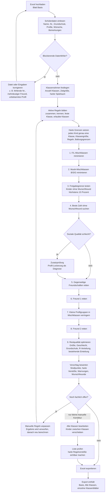

# Klassenbildung

Diese Streamlit-App unterstützt Schulen dabei, aus einer Excel-Schülerliste eine
prüfbare Klasseneinteilung zu erstellen. Die App ersetzt keine pädagogische
Freigabe: Sie berechnet einen Vorschlag, zeigt Risiken offen an und erzeugt
danach eine Excel-Datei für die weitere Prüfung.

## Start

```bash
./start_klassenbildung.sh
```

Unter Windows stattdessen `start_klassenbildung.bat` doppelklicken.

Die App läuft danach lokal unter <http://localhost:6767>. Beim ersten Start wird
eine lokale Python-Umgebung angelegt und die benötigten Pakete werden
installiert.

Die App verarbeitet personenbezogene Schülerdaten (Namen, Bemerkungen,
R-/Unterstützungsmarkierungen). Sie läuft ausschließlich lokal und sendet keine
Daten ins Internet. Der Excel-Export enthält dieselben sensiblen Daten und darf
nur an berechtigte Personen weitergegeben werden.

## Ablauf in der App

Die App führt in vier Reitern durch den Ablauf: `1 Excel prüfen`,
`2 Einstellungen`, `3 Berechnen`, `4 Ergebnis`. Der Schulablauf ist in
[docs/school_user_workflow.md](docs/school_user_workflow.md) Schritt für Schritt
beschrieben.

## Rechenweg auf einen Blick




## Was die App aus der Excel-Datei liest

Die wichtigste Wahrheit steht im Excel-Blatt `Basis`. Daraus werden pro Kind
unter anderem gelesen:

- Zielklasse aus der alten Datei, falls vorhanden
- Schülernummer und Name
- abgebende Grundschule und Grundschulklasse
- Geschlecht
- Fremdsprache F oder L
- Musikprofil B, S, G oder Reg
- Wunschfreund 1 und Wunschfreund 2
- Bemerkungen
- R- oder Unterstützungsmarkierungen

Andere Excel-Blätter können zur Ansicht vorhanden sein, die Berechnung richtet
sich aber nach dem importierten `Basis`-Blatt und den Einstellungen in der App.

## Harte Regeln

Harte Regeln sind Bedingungen, die eine Lösung nicht verletzen darf. Wenn eine
harte Regel nicht erfüllbar ist, ist die Einteilung fachlich nicht freigabefähig.

- Jedes Kind muss genau einer Klasse zugeordnet werden.
- Jede Klasse muss innerhalb der eingestellten Mindest- und Höchstgröße bleiben.
- Aktive manuelle Regeln werden eingehalten: zusammen, trennen, feste Klasse oder
  erlaubte Klassen.
- Ein Kind darf nur in Klassen landen, die grundsätzlich erlaubt sind.
- Die Freigabegrenzen prüfen Ballungen, zum Beispiel zu viele Kinder aus einer
  Grundschule, zu viele Kinder aus derselben Grundschulklasse oder zu viele
  R-/Unterstützungsmarkierungen in einer Klasse.

## Weiche Ziele und Strafpunkte

Weiche Ziele sind Wünsche, die gegeneinander abgewogen werden. Dafür nutzt die
App Strafpunkte: weniger Punkte bedeutet eine bessere Lösung. Eine Lösung mit
wenigen Strafpunkten kann trotzdem blockiert sein, wenn harte Regeln verletzt
werden.

Wichtige Strafpunkt-Bereiche sind:

- getrennte Freundschaften
- Kinder ohne einen Wunschfreund in der Klasse
- F/L-Mischklassen und kleine F/L-Minderheiten
- Musik-Mischklassen zwischen B, S und G
- zu kleine oder zu große Abweichungen vom Wunschbereich der Klassengröße
- ungleich verteilte R-/Unterstützungsmarkierungen
- starke Geschlechter-Schieflage
- Ballungen nach Grundschule oder Grundschulklasse
- Abweichungen von einer bestehenden Einteilung, falls diese gewichtet wird

## Warum die Berechnung mehrere Phasen hat

Die App rechnet nicht alles in einem einzigen Schritt durcheinander. Sie arbeitet
in Phasen, damit wichtige Ziele nicht später wieder kaputtoptimiert werden.

Beispiel: Wenn die App in Phase 1 die bestmögliche Zahl an F/L-Mischklassen
gefunden hat, wird diese Zahl als Grenze festgehalten. Danach sucht die nächste
Phase innerhalb dieser Grenze weiter. So entsteht ein Vorschlag, der zuerst die
groben Profil- und Sozialziele absichert und danach die Restqualität verbessert.

Wenn eine spätere Phase im Zeitlimit keine bessere gültige Lösung findet, nimmt
die App die letzte gültige Lösung weiter. Das Ergebnis zeigt dann, welche Phase
die sichtbare Einteilung geliefert hat.

## Bemerkungen und manuelle Regeln

Bemerkungen aus der Excel-Datei werden eingelesen, im Klassenboard markiert und
in den Export geschrieben. Die App interpretiert diesen Freitext aber nicht und
wandelt ihn nicht automatisch in Regeln um.

Manuelle Regeln sind harte Bedingungen und werden im Bereich
`Aktive manuelle Regeln` verwaltet:

- Trennen
- Zusammen
- Klassenfixierung
- erlaubte Klassen

Nur aktive Regeln gehen in die nächste Berechnung ein. Wird eine Regel geändert,
verwirft die App das bisherige Ergebnis und bittet um eine neue Berechnung.

## Prüfung und Export

Nach der Berechnung zeigt die App genau eine beste Lösung. Der Abschnitt
`Prüfung` nennt die fachlichen Kennzahlen: harte Verstöße, Kinder ohne
Wunschfreund, erfüllte Freundeswünsche sowie F/L- und Musik-Mischklassen.

Unter `Alle Klassen` lässt sich die Einteilung per Drag-and-drop nachbearbeiten.
Diese manuelle Änderung gilt für den Excel-Download. Der Button `Liste prüfen`
zeigt, ob die bearbeitete Liste harte Regeln verletzt.

Der Export schreibt:

- `Basis`: ursprüngliches Basisblatt mit aktualisierter Zielklasse
- `Alle Klassen`: alle Klassen nebeneinander als schnelle Gesamtübersicht
- einzelne Klassenblätter wie `5a`, `5b`, `5c`

Offene Datenprobleme, ungeklärte Bemerkungen oder Warnungen bleiben fachlich
relevant. Ein Download allein bedeutet deshalb noch keine endgültige Freigabe.

## Entwicklerprüfung

Vor einem Commit sollte mindestens diese lokale Prüfung laufen:

```bash
.venv/bin/python -m compileall app.py klassenbildung
.venv/bin/python -m ruff check app.py klassenbildung tests --select F
.venv/bin/python -m pytest
git diff --check
```

`tests/test_app_structure.py` prüft dabei, dass jede Funktion in `app.py` von
`main()` aus erreichbar ist. Damit fällt auf, wenn ein Umbau eine Ansicht
abhängt und toten Code zurücklässt.
